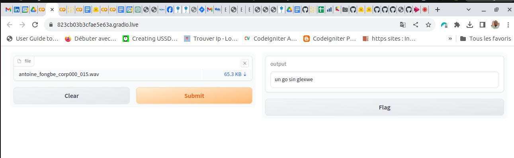

# Modèle de Reconnaissance Automatique de la Parole (ASR)

Ce référentiel contient un modèle de Reconnaissance Automatique de la Parole (ASR) pré-entraîné pour la langue Fongbe, une langue majoritairement parlée au Bénin et au Togo. Pour rappel, l'ASR est une technologie qui permet de convertir automatiquement la parole en texte écrit.

## Modèle pré-entraîné

Ce modèle ASR a été pré-entraîné sur un grand corpus de données en langue Fongbe de ALFFA_PUBLIC. Il est basé sur l'architecture des Transformers, ce qui lui permet d'obtenir d'excellentes performances en matière de transcription audio.

## Utilisation

Vous pouvez utiliser ce modèle ASR pour transcrire des fichiers audio en langue Fongbe en texte écrit. Voici comment l'utiliser dans Python :

```python
import torch
import soundfile as sf
from transformers import AutoProcessor, AutoModelForCTC

# Charger le modèle ASR
processor = AutoProcessor.from_pretrained("billfass/fongbe_asr_model")
model = AutoModelForCTC.from_pretrained("billfass/fongbe_asr_model")

# Fonction pour effectuer la transcription audio
def transcribe_audio(audio_file):
    # Charger le fichier audio
    audio_input, _ = sf.read(audio_file)

    # Transcrire l'audio
    inputs = processor(audio_input, return_tensors="pt", padding="longest")
    with torch.no_grad():
        logits = model(input_values=inputs.input_values).logits

    # Convertir les logits en texte
    predicted_ids = torch.argmax(logits, dim=-1)
    transcription = processor.batch_decode(predicted_ids)[0]

    return transcription

# Exemple d'utilisation
audio_file = "chemin_vers_votre_fichier_audio.wav"
transcription = transcribe_audio(audio_file)
print("Transcription:", transcription)
```
### Tester le modèle avec Gradio
Exécutez le fichier demo.ipynb ou demo.py pour tester le modèle avec Gradio. Vous aurez un truc comme suit :



### Tester le modèle avec FAST API
Exécutez le fichier main.py pour tester le modèle avec FastApi.

## Limitations et Biais

- Entraîné sur un ensemble de données spécifique, il peut ne pas généraliser bien à d'autres types de texte.
- Ce modèle n'est entraîné que pour la langue fongbe.

## Auteurs

- **Fassinou Bile**
- **billfass2010@gmail.com**
  
## Remerciements

Un merci spécial à Hugging Face pour avoir fourni la bibliothèque Transformers qui a rendu ce projet possible.

---